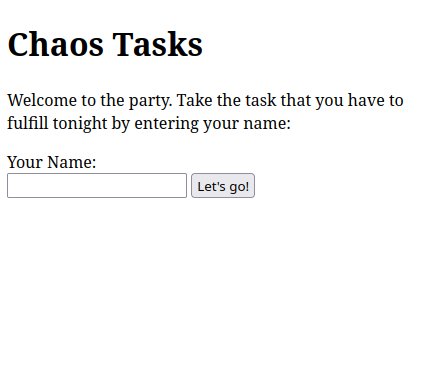
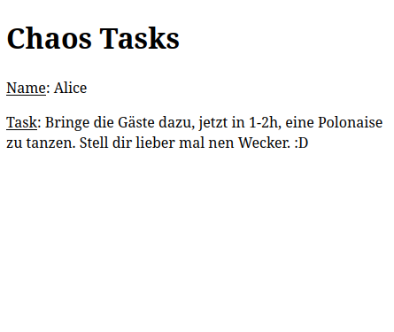

# Chaos Tasks
A simple party game that assigns every guest a random and secret task he or she has to fulfill. Inspired by [Chaoskarten](https://www.chaoskarten.de/).

[](https://github.com/unpeeled/chaos-tasks-game/actions/workflows/go.yml) 
[](https://github.com/unpeeled/chaos-tasks-game/actions/workflows/docker-compose.yml)
| Start | Task received |
|-------|---------------|
| |  |

## Information
- Everyone should use his/her own phone. Once a task is received a cookie is created on users phone. No new task can be received until cookie is deleted.
- No JavaScript
- Language Support for English and German (is set default via Browser and can not be changed)

### Software Requirements

For manual install:

- postgresql (13.13 is tested)
- go (1.19 is tested)
- bash

For docker-compose install:

- docker
- docker-compose

## Setup
There are two possible ways described to install chaos-tasks:

### Manual
1. Edit `etc/chaostasks-env.sh` with the details of your postgres database. Either the entrie `DB_PASSWORD` or `DB_PASSWORD_FILE` has to be set. If The file is used, it shall only contain the password.
2. Then source the env file:
    ```bash
    source etc/chaostasks-env.sh
    ```
3. Create the database with its content. Execute `scripts/1-create-db.sh`.
4. Import tasks from a text file:
    ```bash
   cat <Path to file with tasks> | scripts/2-impot-tasks.sh
    ```
    Example tasks (in german) are stored in `example_tasks_german.txt`.
    One line per task shall be used.
5. Compile the program and start it:
    ```bash
    cd src/chaostasks/
    go build
    ./chaostasks
    ```
6. Browse to `http://127.0.0.1:3000`

### Docker Compose
Docker-compose can be used to start the app easy.

First a password file for database has to be created in topdir of repo: `.db_passwd.txt`

Afterwards starting the app can be done with:
```bash
docker-compose up -d
```

Afterwards the app is running but has no tasks included. To add tasks execute the following command: 
```bash
cat <Path to file with tasks> | docker exec -i $(docker ps -aqf "ancestor=chaos-tasks-game_app") /bin/sh /opt/chaostasks/bin/2-import-tasks.sh
```

Then your app is ready. To get the IP-Address and test if app is reachable:
```bash
IP_ADDRESS=$(docker inspect -f '{{range.NetworkSettings.Networks}}{{.IPAddress}}{{end}}' $(docker ps -aqf "ancestor=chaos-tasks-game_app"))
curl "http://${IP_ADDRESS}:3000"
```
## Things planned
- Systemd-Unit-File
- Ngninx HTTPS integration
- user management
- site customisation
- task management in web frontend.
- tests
- github action for tests
- demo page
